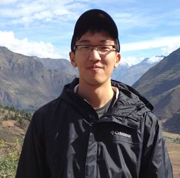

Welcome to my Github Pages site! It contains some basic information about myself, my experiences, interests, and some projects I do in my spare time. 

 

## About

Besides drinking copious amounts of coffee and planning weekend hikes around the greater Toronto area, I am an avid **[R user](https://www.r-project.org/)** and strong believer in reproducible workflows for research.  

The journey up to this point has been quite non-linear... I finished undergrad with a degree in [medical biophysics](https://www.schulich.uwo.ca/biophysics/undergraduate/future_students/what_is_medical_biophysics.html), but shifted my interest to population health for my [graduate studies](https://www.bu.edu/sph/) where I discovered R as an amazing tool for data analysis. I consider myself a **data science enthusiast** as I'm still building my skills in SQL and Python.  

I currently work at a [global health](http://www.cghr.org/) research non-profit organization in Toronto, Canada.  
