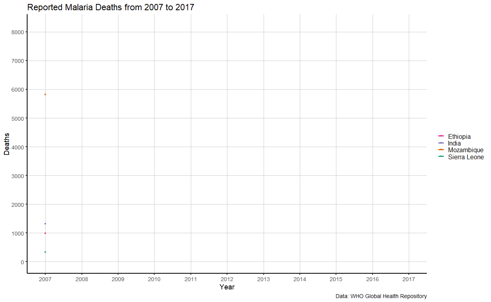

# Projects
### sendtg: Send Telegram Notifications with R
The [`sendtg`](https://github.com/eugejoh/sendtg) package is provides a number of simple R functions to send Telegram messages. This is a wrapper around the [`telegram.bot`](https://github.com/ebeneditos/telegram.bot) R package. 

 

### pgtools: Simple tools for writing tables to PostgreSQL from R
The [`pgtools`](https://github.com/eugejoh/WHOmortality) package.

 

### WHOmortality: Tools to access and import the World Health Organization Mortality Database
The [`WHOmortality`](https://github.com/eugejoh/WHOmortality) package.

 

# Data Visualizations

This page contains some **data visualizations** on work I've done over the years using variety of R packages. Most of what I produce relies on the [ggplot2](https://ggplot2.tidyverse.org/) package based on Leland Wilkinson's the grammar of graphics framework. The majority of data visualizations below are from [previous blog posts](https://opendatascience.com/user/eugene-joh/) demonstrating using R for data wrangling and visualization.  

### Emergency Department Visit Diagnoses
This *tree map* was created using data from the [National Health Ambulatory Medical Care Survey (NHAMCS)](https://www.cdc.gov/nchs/ahcd/index.htm) from the United States. The groups in the tree map are the different diagnoses given for each emergency department visit, based on [International Classification of Disease Codes 9th Revision](https://en.wikipedia.org/wiki/International_Statistical_Classification_of_Diseases_and_Related_Health_Problems) (ICD-9) codes captured in the dataset.  

*Created using the [treemap](https://cran.r-project.org/web/packages/treemap/index.html) package.*

 

### Reported Malaria Deaths
The World Health Organization (WHO) maintains a [mortality repository](https://www.who.int/gho/en/), that contains data on deaths across the world. One of the key pieces of data collected by the WHO are the reported number of [malaria deaths](https://www.who.int/malaria/en/). These are numbers are provided the national malaria control programmes that exist in these countries, and primarily represent deaths that occurred in a health facility/hospital. The graph below displays the number of reported malaria deaths over time in four select countries: Ethiopia, Mozambique, Sierra Leone, and India.  

*Created using the [ggplot2](https://ggplot2.tidyverse.org/) and [gganimate](https://gganimate.com/) packages.*

 

### Refugees and Populations of Concern
The [United Nations High Commissioner for Refugees (UNHCR)](https://www.unhcr.org/data.html), the UN Refugee Agency obtain information of displaced persons from around the world, including refugees. The stacked bar chart displays the increase of these [Populations of Concern](https://www.unhcr.org/ph/persons-concern-unhcr) over time. Note that definitions of these groups were introduced at different time points but the overall number of displaced peoples have steadily increased.  

*Created using the [ggplot2](https://ggplot2.tidyverse.org/) package.*

 

### Seasonality of Watermain Breaks
The City of Toronto has an [open data portal](https://open.toronto.ca/) with datasets on watermain breaks throughout the city. The animated boxplots display the number of watermain breaks in each month over a 26 year period. The blue line represents the number of watermain breaks for a specific year.  

*Created using the [ggplot2](https://ggplot2.tidyverse.org/) and [gganimate](https://gganimate.com/) packages.*

 

### Laminar Flow in a Pipe
[Hagen–Poiseuille's law](https://en.wikipedia.org/wiki/Hagen%E2%80%93Poiseuille_equation) describes the behaviour of an incompressible fluid in laminar flow within a cylindrical pipe with a constant radius. The animated visualization shows the changes in the velocity profile when the pressure difference increases, here at each time point (*t*).  

*Created using the [ggplot2](https://ggplot2.tidyverse.org/) and [gganimate](https://gganimate.com/) packages.*

 

